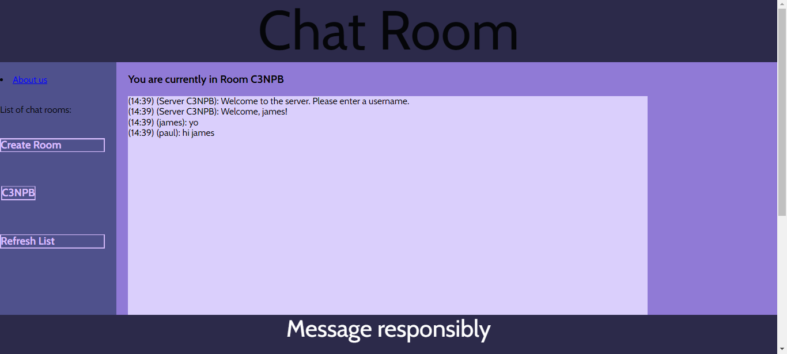

# Web Chat Server - Assignment 2
> Course: CSCI 2020U: Software Systems Development and Integration

## Project Information
Have you ever been chatting with someone over email, only to have to constantly refresh the page to see 
if they sent their reply? To save you from carpal tunnel, our group decided to make a web chat server, 
where you can type in real time with other users. Our server allows users to create or join chat rooms, 
where messages will automatically appear when other users send them. We made sure all users can simultaneously 
type, receive and send messages without any issues, to ensure a seamless chatting experience.
This program was built fully in IntelliJ IDEA, by David Houle-Tymeczko, Daniel Zajac and Heisn Nithysingha.

> Chat Room Example:

> > Screenshots (todo):

### Project Improvements
Since users may not want to constantly click the 'Refresh List' button in order to see if other users have 
created new rooms, our chat server refreshes the list automatically upon some common user actions, such as creating 
a new room.
Our chat server also allows users to click on the room they are already in to re-join the room as a 'different' user. 
This saves them from the minor inconvenience of having to join a different room to be able to join the original 
room as a new user.

We also included an 'About us' page, which has clickable links with our GitHub profiles attached.

### How to run
To run this project, you must first install IntelliJ IDEA, GlassFish 7.0.0 (or similar versions) and git.
- First, navigate to our GitHub repository at
  https://github.com/OntarioTech-CS-program/w23-csci2020u-assignment02-nithysingha-zajac-houletymeczko. Select the 'code'
  dropdown menu, and copy the HTTPS link under the 'clone' tab.
- Then, open any shell of your choice, and navigate to your desired directory, where you will clone the project.
- type 'git clone *link*', where *link* represents the HTTPS link you copied from our repository.
- Now, open the clone repository in IntelliJ. You will see a pop-up in the bottom right asking you to load a maven 
  build script, where you click the 'Load Maven Project' button.
- To run the local server, you must first configure glassfish. To do this, click 'Edit Configurations' in the top right
  of IntelliJ, then click 'Add Configuration' and select GlassFish local. In the menu that pops up, type domain1 into the
  domain entry box, then switch to the 'Deployment' tab and select 'WSChatServer:war exploded'.
- At this point, you can click the green arrow near the top right to run the local server.
- When the server loads, IntelliJ will launch our chat server in either your most recently opened browser, or your
  default browser.
- If you wish to simulate a multi-user experience on a local GlassFish server, you can also duplicate the chat 
  server tab within your browser.

### External Resources
Aside from the default dependencies in the maven project, Jakarta websocket and servlet dependencies were used to 
handle the socket connections and requests within our program. We also used the json library 
to parse and create json objects.
The code for using these dependencies can be copied from the 'pom.xml' file within our project files. 

[1] https://mvnrepository.com/artifact/jakarta.servlet/jakarta.servlet-api

[2] https://mvnrepository.com/artifact/jakarta.websocket/jakarta.websocket-api

[3] https://mvnrepository.com/artifact/org.json/json